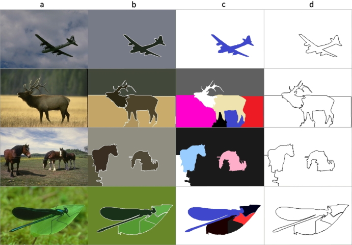
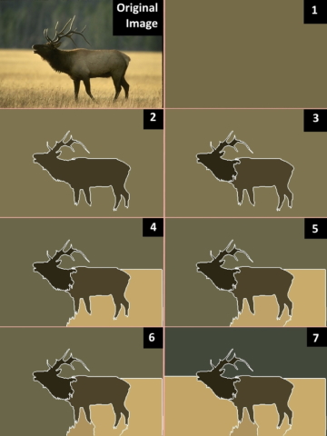

# S-MST Image-Segmentation C++
C++ implementation of the method described in the paper [Sequential image segmentation based on minimum spanning tree representation](https://www.sciencedirect.com/science/article/abs/pii/S0167865516301192).


## Reference:

```
@article{SAGLAM2017155,
title = "Sequential image segmentation based on minimum spanning tree representation",
journal = "Pattern Recognition Letters",
volume = "87",
pages = "155-162",
year = "2017",
issn = "0167-8655",
doi = "https://doi.org/10.1016/j.patrec.2016.06.001",
url = "http://www.sciencedirect.com/science/article/pii/S0167865516301192",
author = "Ali Saglam and Nurdan Akhan Baykan"
}
```




### Run demo: 
```
main.cpp
```

### Parameters:
*``l``* : The length of the scanning frame (sub-string) that scans through the PSR-MST. If the value is ``0``, it is computed by ``int( sqrt(M * N) / 2``).

*``m``* : The coefficient of the parameters *``c``* that calculated automatically using the differential of the PSR-MST in the [source paper](https://www.sciencedirect.com/science/article/abs/pii/S0167865516301192). If no value is given, the default value is ``3``.


### Segmentation  fuction:

``smst mysmst(img);``    // The PSR-MST is created using Fibonacci Heap data structure

``mysmst.segmentation(200, 3);`` -----> *l* = 200, *m* = 3 ------ If *l* is ``0``, it is computed by ``int( sqrt(M * N) / 2``)

-------------------------------------------------------------




## Reference:

```
@article{SAGLAM2017155,
title = "Sequential image segmentation based on minimum spanning tree representation",
journal = "Pattern Recognition Letters",
volume = "87",
pages = "155-162",
year = "2017",
issn = "0167-8655",
doi = "https://doi.org/10.1016/j.patrec.2016.06.001",
url = "http://www.sciencedirect.com/science/article/pii/S0167865516301192",
author = "Ali Saglam and Nurdan Akhan Baykan"
}
```
